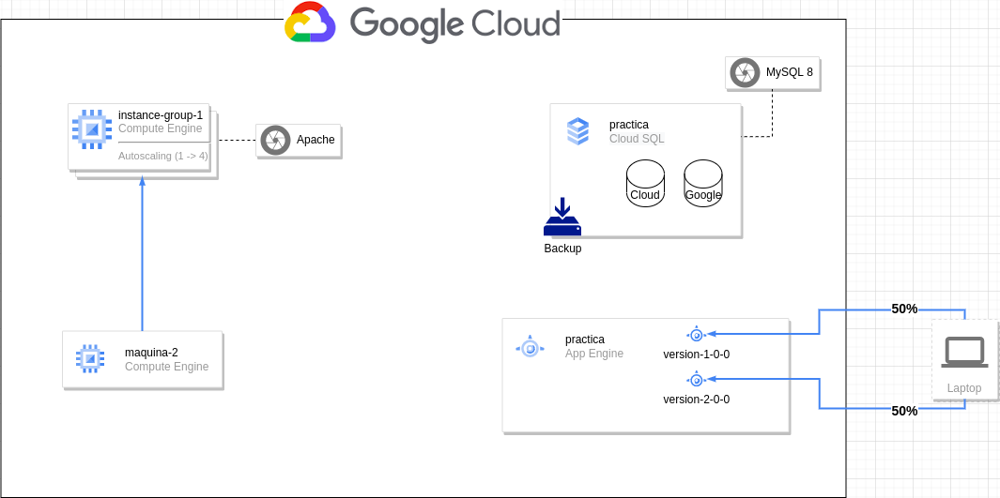

# Migracion a la nube - GCP

## ID del Proyecto en el que se realizan las pruebas del contenido de este repositorio 

proyecto-cristina-garcia

## Contenido del repositorio

- Arquitectura GCP:

- En la carpeta `cloudsql` se encuentra el archivo `app.yaml` editado para el despliegue correspondiente a la cuarta parte con la configuración generada en la segunda parte.

- En la carpeta `prueba-estres` se encuentra el archivo `script.sh para realizar la prueba de estrés para comprobar el autoescalado de la cuarta parte. 
    - Para ejecutar el script, es necesario realizarlo de la siguiente manera `sudo sh script.sh <IP_MAQUINA>`
- En la carpeta `terraform`, se encuentran los archivos terraform pertenecientes al bonus de la práctica.
    - Para que todo funcione correctamente, se deben de lanzar tanto el plan como el apply de terraform incluyendo`-var-file=variables.tfvars`, es decir, `terraform plan -var-file=variables.tfvars` y `terraform apply -var-file=variables.tfvars`.

## Clonado del repositorio

Para el clonado del repositorio solo es necesario realizarlo de la siguiente manera:

- git clone git@github.com:KeepCodingCloudDevops6/Migracionalanube-CrisGarcia.git o bien, 
- git clone https://github.com/KeepCodingCloudDevops6/Migracionalanube-CrisGarcia.git

Cristina Garcia Rodriguez
